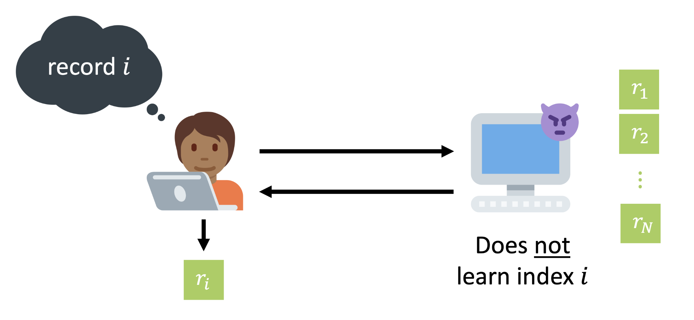

<br/>
    
<h1 align="center">incognito dB</h1>

<br />

<p align="center">
  A private information retrival webpage powered by <a href="https://blyss.dev/">Spiral</a> that allows anonymous access to a comprehensive selection of articles, ensuring the privacy of users while delivering the requested content.
</p>

<br />

<p align="center">
  <a href="">Docs</a>
  &nbsp; | &nbsp;
  <a href="">Website</a>
  &nbsp; | &nbsp;
  <a href="mailto:rogerrovi2006@gmail.com">Contact</a>
</p>

<br />

<p align="center">
  <a href="https://github.com/Gasofa06/incognito-db/blob/main/LICENSE">
    
  </a>
  <a href="https://twitter.com/rovi_roger">
    
  </a>
  <a href="https://blyss.dev/">
    
  </a>
</p>

--------------------------------------------------------------------------------

## Introduction

With the sole purpose of achieving the level of privacy and confidentiality that we all wish to attain in our database queries, the [_incognito dB_]() platform utilizes homomorphic encryption for [private information retrieval](https://en.wikipedia.org/wiki/Private_information_retrieval). This approach guarantees that no individual, even including the server itself, possesses awareness of the specific information we have both requested and received.

Data is **now** cryptographically protected even throughout the process.

<br/>

</a>

## Table of Contents

1. [Live Demo](#live-demo)
2. [Platform Description](#platform-description)
   * [Features and Benefits](#features-and-benefits)
   * [Limitations](#limitations)
3. [Run in Local Device](#run-in-local-device)
   * [Requirements](#requirements)
   * [Quick Start](#quick-start)
4. [Disclamer](#disclamer)
5. [Credits](#credits)
   * [External Contributions](#external-contributions)
   * [Acknowledgments](#acknowledgments)
6. [Contact](#contact)
7. [License](#license)

## Live Demo

You can quickly experience the _indognito dB_ platform by visiting its own [website]().

...

## Platform Description

### Features and Benefits

### Limitations

## Run in Local Device

### Requirements

### Quick Start

1. Commence by cloning the repository to your local device:
```
git clone <repository_url>
```

2. Proceed to the `components/client` directory and invoke the subsequent command to compile the WebAssembly code:
```
wasm-pack build --target web --out-dir ../../site/pkg
```

3. Within the `server/database` repository, employ the provided Python "build" script to establish the fundamental database components.

4. Transition to the `components/spiral-rs` directory. Issue the ensuing command to preprocess the database:
```
cargo run --bin preprocess_db -- ../../server/database/db/db.txt ../../server/database/db/preprocessed_db.txt
```

5. Conclude by activating the local server. Navigate to the `server/actix-server/src` directory and implement the following command:

```
cargo run build -- ../../server/database/db/preprocessed_db.txt 8080
```

Now you are runing it in your own device in localhost port 8080.

## Credits

**Project Author:** [Roger Rovira]().

Emerging from the final stages of my high school education in Barcelona, Catalonia, this project has taken shape as the _Treball de Recerca_ that Catalan students are required to present during the last year of their studies.

### External Contributions

The development of [_incognito dB_]() was enriched by the valuable contribution of the open-source library Spiral and the SpiralWiki project.

* **Spiral**: [company webpage](https://blyss.dev/).
* **SpiralWiki**: [project web](https://spiralwiki.com/).

It was thanks to these tools that I was able to successfully implement homomorphic encryption to achieve private information retrieval.

### Acknowledgments

While expressing my thanks to the contributors of Spiral and SpiralWiki, I would also like to extend my appreciation to my mentors and professors. 

Their insightful guidance assisted me throughout the development phase, helping to establish the foundations of the project, the main ideas. Allowing me to materialize, with my own hands, the underlying structure of [_incognito dB_]() through programming.

Thanks 😁.

## Contact

Feel free to reach out if you have any questions, suggestions, or feedback regarding this project. You can contact me via email or connect with me on social media as well.

- **Email**: [rogerrovi2006@gmail.com](mailto:rogerrovi2006@gmail.com)
- **Twitter**: [@rovi_roger](https://twitter.com/rovi_roger)

## License

This project is licensed under the MIT License, see the [LICENSE](LICENSE) file for details.
